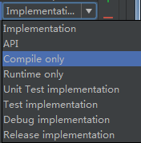
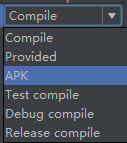

# 升级功能测试
## 一、获取升级信息
### 1.链接 
```
[url过长]:https://api.dinghuo123.com/public/specialVersion?platform=Android&systemVersion=6.0&imei=865903038578968&isBrand=0&versionCode=312&versionName=3.19.0&userId=&userName=&dbid=
```
### 2.数据结构
```
  {
    "code": 200,
    "message": "操作成功",
    "data": {
        "apkUrl": "https://s.beta.myapp.com/myapp/rdmexp/exp/file/comircloudydhagents_4111_4f702a8d-a797-493a-af64-f821e562d9bb.apk",
        "bundleVersion": "",
        "corpId": 0,
        "createTime": "2017-05-25 11:57:07",
        "fileSize": 1548960,
        "id": 4,
        "imei": "",
        "instanceId": 0,
        "isAllowUpdate": true,
        "isBrand": 0,
        "modifyTime": "",
        "netType": 1,
        "newFeature": "1.升级测试2.灰度升级",
        "platform": "",
        "shortBundleVersion": "",
        "systemVersion": "",
        "title": "全部账号升级",
        "updateMode": 2,
        "updateStrategy": 1,
        "userName": "",
        "versionCode": 450,
        "versionName": "4.12.0"
      }
  }
```
### 3.字段说明
|字段|类型|说明|作用|备注|
|---|---|----|----|----|
|isAllowUpdate|boolean|是否允许更新|false:不允许升级；true：允许升级，执行下一步|
|updateMode|int|升级模式|2：走bugly升级；否则，走服务器升级|[bugly升级只针对v3.19.0.312.apk下发策略](bugly升级只针对v3.19.0.312.apk下发策略)|
|netType|int|网络类型|1：只在wifi情况下提示升级；2:只在移动网络下提示升级；3：只在有网情况下提示升级|[只在走公司服务器升级流程才生效](只在走公司服务器升级流程才生效)|
|updateStrategy|int|升级策略|1：非强制性升级；2：强制性升级|[只在走公司服务器升级流程才生效](只在走公司服务器升级流程才生效)|
|isBrand|int|是否是品牌定制|0：不是；1：是|[只在走公司服务器升级流程才生效](只在走公司服务器升级流程才生效)|
|newFeature|string|升级信息说明|比如："1.修复bug\n2.升级测试"|[只在走公司服务器升级流程才生效](只在走公司服务器升级流程才生效)|
|title|string|升级标题文本|比如："App6.0.4"|[只在走公司服务器升级流程才生效](只在走公司服务器升级流程才生效)|
|apkUrl|string|链接|apk下载链接|[只在走公司服务器升级流程才生效](只在走公司服务器升级流程才生效)|

## 二、bugly升级
[图片查看](img/bugly.png)
### 基础配置
|字段|说明|
|---|---|
|策略下发条件| 指定原版本3.19.0.312|
|策略启动条件|手动启动|
|下发上限|3人|
|激活上限|3人|
|升级标题|App名+6.0.4.667|
|升级信息说明|  1.bug修复\n2.升级测试|

# cordova学习
[cordova](demo/cordova)

# 混淆使用
[混淆](demo/proguard/proguard.md)

# android gradle 依赖
## 图片
| gradle 3.0 | gradle 2.0 |
| ---------- | ---------- |
|  |  |

## 说明
### gradle 3.0
|      指令      |     作用     | 说明 |
| -------------- | ------------| ---- |
| implementation | 不会对外暴露依赖；构建时间有所改进 | 1.moduleA依赖moduleB,moduleB使用implementation依赖moduleC，则moduleA访问不了moduleC；2.moduleC实现有所改变，则只会重新编译moduleC和moduleB |
| api            | 可以依赖传递；构建时间有所增加;等同complie | 1.moduleA依赖moduleB,moduleB使用implementation依赖moduleC，则moduleA可以访问moduleC；2.moduleC实现有所改变，则会编译所有使用moduleC的实现的模块，也就是moduleA/moduleB/moduleC都重新编译 |
| complieOnly | 编译时需要用到module，运行时是可选的；可减少apk大小；等同provided | 无 |
| runtimeOnly | 运行时需要用到模块；等同apk | 无 |
| annotationProcessor | 需要依赖注解库时用到；提供构建性能 | annotationProcessor 'com.jakewharton:butterknife-compiler:8.8.1' |

## 感谢
[android官网](https://developer.android.google.cn/studio/build)

# RxJava 2.x
## 概念
```java
Rx是ReactiveX的缩写，而ReactiveX是Reactive Extensions的缩写。Rxjava顾名思义即是Java上的异步和基于事件响应式编程库。
RxJava基于观察者模式，主要有四个部分：观察者、被观察者、订阅、事件.
例子：
  FlowableSubscriber<String> subscriber = new FlowableSubscriber<String>(){
    @Override
    public void onSubscribe(Subscription s){
      //订阅时候的操作
      s.request(Long.MAX_VALUE);//请求多少事件，这里表示不限制
    }
    @Override
    public void onNext(String s){
      Log.i("tag",s);
    }
    @Override
    public void onError(Throwable t){
      
    }
    @Override
    public void onComplete(){
    
    }
  }
  由此可见，观察者身上有onNext、onError、onComplete事件
  Flowable<String> flowable = Flowable.create(new FlowableOnSubscribe<String>(){
    @Override
    public void subscribe(FlowableEmitter<String> e) throw Exception {
      e.onNext("test1");
      e.onNext("test2");
      e.onComplete();
    }
  },BackpressureStrategy.BUFFER);//背压设置
  flowable.subsribe(subscriber);
  输出： test1->test2
  
```
## Actions
### Consumer
从上面可以看到FlowableSubscriper中我们只关心onNext方法，那么可以用Consumer来作观察者：‘’
```
  flowable.subscribe(new Consumer<String>(){
    @Override
    public void accept(String s){
      //相当于onNext事件处理
      Log.i("tag",s);
    }
  });
  或
  flowable.subscribe(new Consumer<String>(){
    @Override
    public void accept(String s) throws Exception{
    }
  },new Consumer<Throwable>(){//相当于onError
    @Override
    public void accept(Throwable throwable) throws Exception{
    }
  },new Action(){//相当于onComplete，注意这里是Action
    @Override
    public void run() throws Exception{
    }
  },new Consumer<Subscription>(){//相当于onSubscribe
    @Override
    public void accept(Subscription subscription) throws Exception{
    }
    }
  }
  其中，Action和Consumer都属于Actions,不过Action属于无参数类型，Consumer属于单一参数类型。多参数类型使用：  
  BigConsumer<T1,T2>: 双参数类型  
  Consumer<Object[]>: 多参数类型  
```
## Observable和Observer
```java
  Observable<String> observale = Observable.create(new ObservableOnSubscribe<String>(){
    @Override
    public void subscribe(ObservableEmitter<Stirng> e) throws Exception{
      e.onNext("text1);
      e.onNext("text2");
      e.onComplete();
    }
  });
  由于Observable不支持订阅Subscriber观察者，需要使用Observer作为观察者
  Observer<String> observer = new Oberser<String>(){
    @Override
    public void onSubscribe(Disposable d){
      //订阅时操作，无需request
    }
    @Override
    public void onNext(String s){
      Log.i("observer",s);
    }
    @Override
    publid void onError(Throwable e){
    }
    @Override
    public void onComplete(){
    }   
  };
  observable.subscribe(observer);
```

## Observable和Flowable
以上发现，Observable和Flowable,前者不需要背压参数和请求资源操作。
使用Observable: 不超过1000个元素、随着时间流逝基本不会oom;不支持Java Steam(Java 8新特性）；开销比Flowable低
使用Flowable: 超过10K个元素;读写硬盘操作；通过JDBC读取数据库网络IO操作
### BackPressure
背压就是生产者的生产速度大于消费者消费速度从而导致的问题
### Single和SingleObserver
单一事件流，即只有一个onNext事件，接着就触发onComplete或者onError
Single只包含两个事件，一个是正常处理成功的onSuccess，另一个是处理失败的onError,它只发送一次消息
```
  Single<String> single = Single.create(new SingleOnSubscriber<String>(){
    @Override
    public void subscribe(SingleEmitter<String> e) throws Exception{
      e.onSuccess("text1");
      e.onSuccess("test3");//错误写法，重复调用不会处理
    }
  });
  single.subscribe(new SingleObserver<String>(){
    @Override
    publid void onSubscribe(Disposable d){
    }
    @Override
    public void onSuccess(String s){
      //相当于onNext和onComplete
    }
    @Override
    publid void onError(Throwable e){}
  });
  可用Actions简化Obverser：
  single.subscribe(new BigConsumer<String,Throwable>(){
    @Override
    public void accept(String s,Throwable throwable) throws Exception{
      //onSuccess和onError操作都在这里
    }
  });
```
### Completable和CompletableObserver
如果观察者连onNext事件都不关心，可以使用Completable,它只有onComplete和onError两个事件：
```
  Completable.create(enw CompletableOnSubscribe(){
    @Override
    public void subscribe(CompletableEmitter e) throws Exception {
      e.complete();//单一onComplete或者onError
    }
  }).subscribe(new CompletableObserver(){
    @Override
    public void onSubscribe(Disposable d){}
    @Override
    public void onComplete(){}
    @Override
    public void onError(Throwable e){}
  });
```
### Maybe和MaybeObserver
如果你有一个需求是可能发送一个数据或者不会发送任何数据，这时候你就需要Maybe,它类似于Single和Completable的混合体
Maybe可能会调用以下其中一种情况：
onSuccess或者onError
onComplete或者onError
```
  Maybe<String> maybe = Maybe.create(new MaybeOnSubscribe<String>(){
    @Override
    public void subscribe(MaybeEmitter<String> e) throws Exception{
      e.onSuccess("test");//发送一个数据的情况，或者onError
      //e.onComplete();//不需要发送数据的情况，或者onError
    }
  }).subscribe(new MaybeObserver<String>(){
    @Override
    public void onSubscribe(Disposable d){}
    @Override
    public void onSuccess(String s){
      Log.i("tag",s);
    }
    @Override
    public void onComplete(){
      Log.i("tag","onComplete");
    }
    @Override
    public void onError(Thrwoble e){}
  });
```


