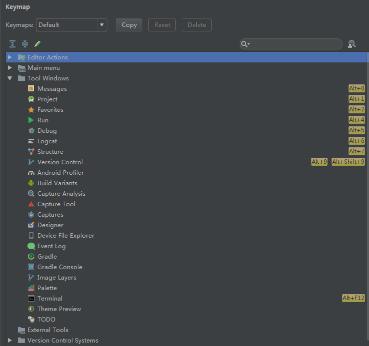
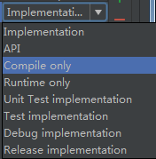
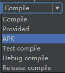
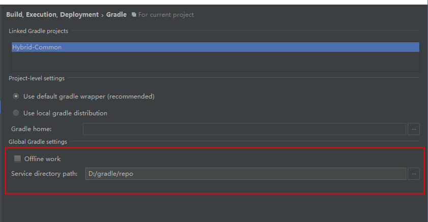

# 一、android studio
## overview
* 基于gradle编译的灵活系统
* 快速及多特性的模拟器
* 同一的android开发环境
* 及时运行：没有编译新的apk，而是推送改变的东西到正在运行的app
* 代码模板和github集成
* 大量的测试工具和框架
* Lint工具：捕捉性能、可用性和版本兼容性等问题
* c++和ndk支持
* 内置支持google云
### 1.主窗口

其中包含：工具栏、导航栏、编辑窗口、工具窗口栏、工具窗口、状态栏
快捷键：

ctrl+e：搜索最近使用的文件
ctrl+f12：该文件的结构视图
ctrl+n：搜索类文件
ctrl+shift+n：搜索文件
alt+f7：查找当前选中的类、方法、字段、参数和语句被引用的地方
# 二、配置构建
### 1.
* 可定义、配置和扩展编译
* 构建多个apk基于相同的工程
* 跨源集重用代码及资源
### 2.applicationId
命名规则：
* 至少包含两个片段(一个.号以上)
* 每个片段必须以字母开始
* 所有字符必须是字母、数字或下划线
#### 3.添加依赖
* 图片

| gradle 3.0 | gradle 2.0 |
| ---------- | ---------- |
|  |  |

* 说明
|      指令      |     作用     | 说明 |
| -------------- | ------------| ---- |
| implementation | 不会对外暴露依赖；构建时间有所改进 | 1.moduleA依赖moduleB,moduleB使用implementation依赖moduleC，则moduleA访问不了moduleC；2.moduleC实现有所改变，则只会重新编译moduleC和moduleB |
| api            | 可以依赖传递；构建时间有所增加;等同complie | 1.moduleA依赖moduleB,moduleB使用implementation依赖moduleC，则moduleA可以访问moduleC；2.moduleC实现有所改变，则会编译所有使用moduleC的实现的模块，也就是moduleA/moduleB/moduleC都重新编译 |
| complieOnly | 编译时需要用到module，运行时是可选的；可减少apk大小；等同provided | 无 |
| runtimeOnly | 运行时需要用到模块；等同apk | 无 |
| annotationProcessor | 需要依赖注解库时用到；提供构建性能 | annotationProcessor 'com.jakewharton:butterknife-compiler:8.8.1' |
* 注解处理器
添加参数：
```groovy
  android {
    defaultConfig {
      javaCompileOptions {
        annotationProcessorOptions {
          argument "key1","value1"
          argument "key2", "value2"
        }
      }
    }
  }
```
不允许注解器错误检查
```groovy
  android {
    defaultConfig {
      javaCompileOptions {
        annotationProcessorOptioins {
          includeCompileClasspath false 
        }
      }
    }
  }
```
* 不包含依赖传递
```groovy
  dependencies {
    implementation("some-library") {
      exclude group: 'com.example.ckr',module: 'native'
    }
  }
```
#### 4.优化构建速度
* 避免编译不必要的资源
```groovy
  android {
    productFlavors {
      dev {
        resConfigs "en", "xxhdpi"//使用英文和xxhdpi目录下的图片
      }
    }
  }
```
* 使用静态依赖版本
如：gradle:2.+ 改为 gradle:2.3.3
* 允许离线模式

* 使用webp格式图片
#### 5.配置构建变体
```groovy
  android {
    defaultConfig {
      manifestPlaceholders = [hostName: "com.ckr.github"]
    }
    buildTypes {
      release {
        minifyEnabled true
      }
      debug {
        applicationIdSuffix ".debug"
        debuggable true
      }
      staging {
        initWith debug    //initWith:允许复制另外一个build types配置的属性
        manifestPlaceholders = [hostName: "com.ckr.github.staging"]
        applicationIdSuffix ".debugStaging"
      }
    }
  }
```
* 配置product flavors
```groovy
  android {
    flavorDimensions "version"
    productFlavors {
      demo {
        dimension "version"
        applicationIdSuffix ".demo"
        versionNameSuffix "-demo"
      }
      full {
        dimension "version"
        applicationIdSuffix ".full"
        versionNameSuffix "-full"
      }
    }
  }
```
* 使用flavor dimensions合并多个product flavors
```groovy
  android {
    flavorDimensions "api","mode"
    productFlavors {
      demo {
        dimension "mode"
      }
      full {
        dimension "mode"
      }
      minApi24 {
        dimension "api"
        minSdkVersion 24
        versionNameSuffix "-minApi24"
      }
    }
  }
```
* 修改默认源集配置
```groovy
  android {
    main {
      java.srcDirs = ['other/java']  //把java默认资源目录'src/main/java'改为'other/java'
      res.srcDirs = ['other/res1','other/res2']  //把默认资源目录'src/main/res'改为'other/res1,other/res2'
      manifest.srcFile 'other/AndroidManifest.xml'
    }
  }
```
#### 6.压缩代码和资源
* mapping.txt:提供原始类和混淆类、方法和字段之间的转换
* seeds.txt:列举没有混淆的类和成员
* usage.txt:列举被移除的代码
* 解混淆：使用retrace.bat(sdk目录/tools/proguard/),如：retrace.bat -verbose mapping.txt obfuscated_trace.txt
#### 7.使用multidex
```groovy
android {
  defaultConfig {
    multiDexEnabled true
  }
  dependencies {
    implementation 'com.android.support:multidex:1.0.3'
  }
}
```
```java
  public class MyApp extends Application {
    @Override
    protected void attachBaseContext(Context context){
      super.attachBaseContext(context);
      MultiDex.install(this);
    }
  }
```
#### 8.分析apk
* Build > Analyze APK
#### 9.命令行
* gradlew task-name: gradlew assembleDebug/gradlew installDebug
# 三、apk调试
## logcat

1.clear logcat: 清除log
2.scroll to the end: 点击跳到log底部
3.up/down the stack trace: 导航日志中的堆栈，选择打印异常总的后续的文件名
4.use soft wraps: 启用换行并防止水平滚动
5.print: 打印log信息
6.restart: 清除log并重新展示log
7.logcat header: 弹出locat header对话框
8.screens capture: 截屏
9.screen record: 录屏
## 搜索日志信息
* 启用正则表达式搜索：Regex
* 在搜索框里键入一个字符
* 在搜索框里按下enter键来保存该搜索字符
## 日志过滤
过滤菜单中，有show only selected application,no filters,edit filter configuration
## 垃圾回收原因
* GC_concurrent: 当堆开始占满时释放内存的并发gc
* GC_for_malloc: 试图在堆已占满时分配内存
* GC_hprof_dump_heap: 当请求一个hprof格式的文件以分析堆时发生gc
* GC_explicit: 当调用gc()时
* GC_external_alloc: 
## 打开堆栈
Analyze->Analyze stacktrace
## 布局检查器
Tools>Layout Inspector
# 测试
## 添加测试
* 打开你要测试的java文件
* ctrl+shift+t: 创建你想要测试的方法和类
## UI测试
使用Espresso Test Recorder
## Monkey
$ adb shell monkey [options] <event-count>
```adb
  $ adb shell monkey -p com.ckr.test -v 500 //启动app并发送500个随机事件
```
|option|描述|
|---|---|
|--help|使用指南|
|-v|无|
|-s <seed>|伪随机生成器的seed值|
|--throttle <milliseconds>|事件之间插入固定延时|
|--pct-touch <percent>|调整触摸事件的百分比|
|--pct-motion <percent>|调整移动事件的百分比|
|--pct-trackball <percent>|调整轨迹事件百分比|
|--pct-nav <percent>|调整键盘式的导航事件百分比|
## 性能调试


# 权限
如果设备运行的是android 6.0及以上版本，在安装的时候，用户不会被通知任何的权限。所以，在运行时，你的app必须要求用户授权危险的权限。
如果用户拒接了权限请求后，你app再次请求权限时，弹框会包含Never ask again的勾选框。如果用户勾选了不再提示框，系统不会再提示用户授权。
## 可选的硬件特性权限
```java
  //相机不是必须的特性，App可以在没有相机的设备上安装
  <uses-feature android:name="android.hardware.camera" android:required="false">
```
注意，你必须通过PackageManager.hasSystemFeature()来检查设备是否有这个camera特性。
## 权限分类
* 普通权限：access_location_extra_commands,access_network_state,access_notification_policy,access_wifi_state,bluetooth,bluetooth_admin,
broadcast_sticky,change_network_state,change_wifi_multicast_state,change_wifi_state,disable_keyguard,expand_status_bar,foreground_service,get_package_size,install_shortcut,internet,kill_background_processes,manage_own_calls,modify_audio_settings,nfc,read_sync_settings,
read_sync_stats,receive_boot_completed,reorder_tasks,request_companion_run_in_background,request_companion_use_data_in_background,
request_delete_packages,request_ignore_battery_optimizations,set_alarm,set_wallpaper,set_wallpaper_hints,transmit_ir,use_fingerprint,
vibrate,wake_lock,write_sync_settings
* 签名权限
* 危险权限：  

|权限组|权限|
|---|---|
|calendar|read_calendar,write_calendar|
|call_log|read_call_log,write_call_log,process_outgoing_calls|
|camera|camera|
|contacts|read_contacts,write_contacts,get_accounts|
|location|access_fine_location,access_coarse_location|
|microphone|record_audio|
|phone|read_phone_state,read_phone_numbers,call_phone,answer_phone_calls,add_voicemail,use_sip|
|sensors|body_sensors|
|sms|send_sms,receive_sms,read_sms,receive_wap_push,receive_mms|
|storage|read_external_storage,write_external_storage|  
* 特殊权限：system_alert_window,write_settings
## 权限请求
* 是否已有权限：ContextCompat.checkSelfPermission()
```java
  if(ContextCompat.checkSelfPermission(activity,Manifest.permission.WRITE_CALENDAR)!=PackageManager.PERMISSION_GRANTED){
  }
```
* 请求权限：requestPermissions()
```java
  ActivityCompat.requestPermissions(activity,Manifest.permission.WRITE_CALENDAR,0)
```
* 处理权限请求结果：
```java
  @Override
  public void onRequestPermissionsResult(int requestCode,String permissions[],int[] grantResults){
    switch(requestCode){
      case 0:
        if(grantResults.length > 0 && grantResults[0]==PackageManager.PERMISSION_GRANTED){
          
        }
        break;
    }
  }
```
# 屏幕适配
## 官方推荐
### 1.使用ConstraintLayout约束布局
### 2.避免使用固定大小
建议使用"match_parent"和"wrap_content"属性，如：
```xml
  <TextView
    android:layout_width="match_parent"
    android:layout_height="wrap_content"
    android:text="ckr"/>
```
### 3.提供可选择的布局
* 方向限定符：添加layout-land目录适配横屏布局
* 使用宽度限定符：layout-w600dp适配宽度为600dp的屏幕
* 使用smallest width限定符。最小宽度限定符指定是屏幕宽高中的最小的一个
### 4.使用独立像素密度(dp)
### 5.提供可选择的图片
### 6.将应用图标放在mipmap目录
### 使用矢量图形

# 版本命名规则
版本格式：0.次版本号.修订号
## 版本号递增规则如下：
### 开发阶段
* 主版本号：0表示正在开发阶段
* 次版本号：增加新的功能时增加
* 修订号：只要有改动就增加
### 维护升级阶段
* 主版本号：全盘重构时增加；重大功能或方向改变时增加；大范围不兼容之前接口时增加
* 次版本号：增加新的业务功能时增加
* 修订号：增加新的接口时增加；增强和扩展接口功能时增加
## 版本号排序规则
* 先行版本号：意味该版本不稳定，可能存在兼容性问题。其格式为：x.y.z.[a-c][正整数]，如：1.0.0.a101
* 开发版本号：常用于CI-CD(持续集成和持续交付)。其格式为：x.y.z-dev[正整数]，如：1.0.0-dev5.
依次比较主版本号、次版本号和修订号的数值,如：1.0.0<1.0.1<1.1.1<2.0.0;对于先行版本号和开发版本号，有：1.0.0.a100<100,
2.1.0-dev3<2.1.0;当存在字母排序比较，如：1.0.0.a1<1.0.0.b1
## 注意
* 版本一经发布，不得修改其内容，任何修改必须在新版本发布！
* 在接口还没确定下来时，应先使用开发版本号
* 业务功能>功能>接口


# 感谢
[android官网](https://developer.android.google.cn/studio/build)
